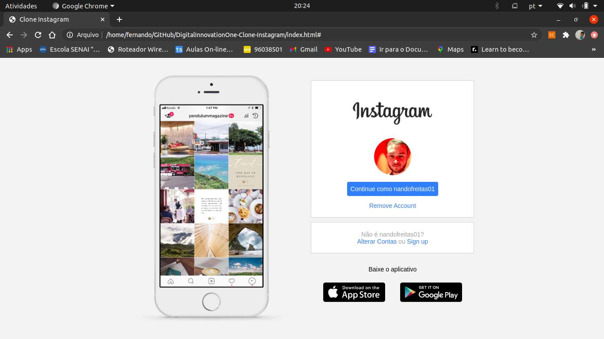

# Instagram Clone
<hr>



### Descrição
<hr>
Como parte das tarefas desenvolvidas no Bootcamp de Angular da plataforma Digital Innovation One desenvolvi um clone do Instagram plataforma trabalhar os conceitos de flexbox.

### Tecnologias usadas

* HTML5
* CSS3
* JS

### Autor
<hr>

```
Fernando Santos De Freitas
```
